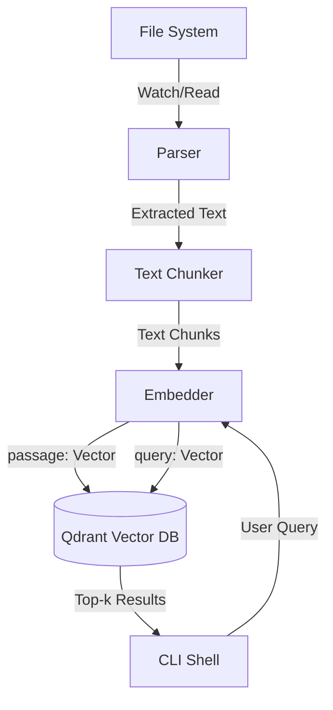

# Architecture

QorFinder is a local-first semantic search CLI. This document details its components and data flow.

## High-Level Data Flow

## Components

### Parser
Extracts text from files. Supported formats:
- Plain text (`.txt`, `.md`)
- PDF (via `lopdf`)
- DOCX (via `docx-rs`)

### Chunker
Splits text into manageable segments for embedding.
- Fixed 512-character window.
- 64-character overlap between adjacent chunks.
- Whitespace is collapsed.

### Embedder
Converts text into vector representations.
- Model: `intfloat/multilingual-e5-small` (384 dimensions).
- Runtime: ONNX via `fastembed`.
- Caching: Downloaded once to `~/.cache/qorfinder/models`, fully offline afterwards.
- Prompt Prefixes: Requires `query: ` prefix for user queries and `passage: ` prefix for indexed chunks.

### Vector DB (Qdrant)
Stores and retrieves embeddings.
- Connection: gRPC on port 6334.
- Distance metric: Cosine distance.
- Idempotency: Uses deterministic UUIDv5 IDs generated from `file_path:chunk_index`. Re-indexing updates existing points.
- Payload Schema: Every point stores `file_path`, `chunk_index`, and `raw_text`.
